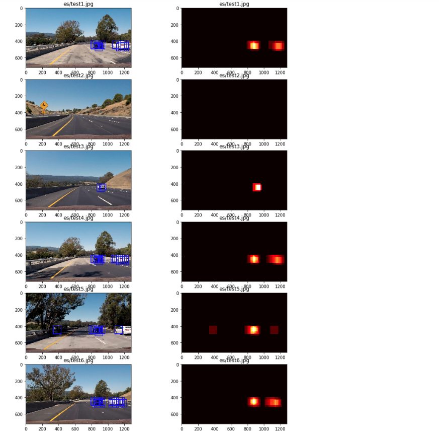
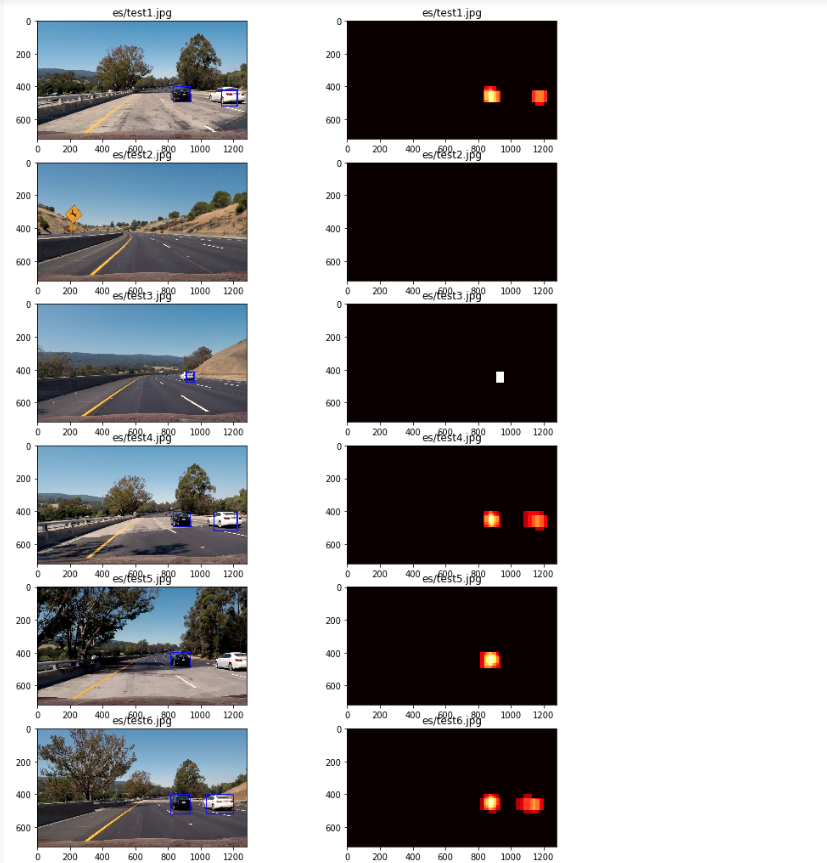

**Vehicle Detection Project**

The goals / steps of this project are the following:

* Perform a Histogram of Oriented Gradients (HOG) feature extraction on a labeled training set of images and train a classifier Linear SVM classifier
* Optionally, you can also apply a color transform and append binned color features, as well as histograms of color, to your HOG feature vector.
* Note: for those first two steps don't forget to normalize your features and randomize a selection for training and testing.
* Implement a sliding-window technique and use your trained classifier to search for vehicles in images.
* Run your pipeline on a video stream (start with the test_video.mp4 and later implement on full project_video.mp4) and create a heat map of recurring detections frame by frame to reject outliers and follow detected vehicles.
* Estimate a bounding box for vehicles detected.

## [Rubric](https://review.udacity.com/#!/rubrics/513/view) Points
### Here I will consider the rubric points individually and describe how I addressed each point in my implementation.  

---
### Writeup / README

#### 1. Provide a Writeup / README that includes all the rubric points and how you addressed each one.  You can submit your writeup as markdown or pdf.  [Here](https://github.com/udacity/CarND-Vehicle-Detection/blob/master/writeup_template.md) is a template writeup for this project you can use as a guide and a starting point.  

You're reading it!

### Histogram of Oriented Gradients (HOG)

#### 1. Explain how (and identify where in your code) you extracted HOG features from the training images.

The code for this step is contained in the first code cell of the IPython notebook with the title *Functions* in the function `get_hog_features`.

I started by reading in all the `vehicle` and `non-vehicle` images.  Here is an example of one of each of the `vehicle` and `non-vehicle` classes:

I then explored different color spaces and different `skimage.hog()` parameters (`orientations`, `pixels_per_cell`, and `cells_per_block`).  I grabbed random images from each of the two classes and displayed them to get a feel for what the `skimage.hog()` output looks like.

Here is an example using the `YCrCb` color space and HOG parameters of `orientations=9`, `pixels_per_cell=(8, 8)` and `cells_per_block=(2, 2)`:

#### 2. Explain how you settled on your final choice of HOG parameters.

I experimented with various combinations of parameters and used them in my SVC training code under the heading *Training* and the above selections resulted in Test Accuracy of over 0.99, the best of my trials.

#### 3. Describe how (and identify where in your code) you trained a classifier using your selected HOG features (and color features if you used them).

I trained a linear SVM using SKLearn in the *Training* cell. First, I extracted features from all the car and non-car images: binned color features, histograms of color and HOG.

Then, I concatenated them, normalized using StandardScaler() from SKLearn and created randomized training and test sets. Finally, I used LinearSVC and the `.fit` function to train the classifier, resulting in a test accuracy of 0.9921.

### Sliding Window Search

#### 1. Describe how (and identify where in your code) you implemented a sliding window search.  How did you decide what scales to search and how much to overlap windows?

I implemented a sliding window search in the function find_cars() in the cell with the title *Detecting Vehicles: Find Cars with Variable Scale*. This function resulted from test code I included in the cells *Detecting Vehicles in Test Images* and *Detecting Vehicles: Compute HOG Only Once for Better Performance*, which proved the basic algorithms and code using test images.

After experimenting with various window sizes and scales, I settled on a window of 64 pixels and scales of 1.0, 1.5 and 2.0. This combination seemed to highlight the cars with several overlapping boxes, while generating a minimal number of false positives.

Six test images, vehicle detections and corresponding heatmaps:

#### 2. Show some examples of test images to demonstrate how your pipeline is working.  What did you do to optimize the performance of your classifier?

Ultimately I searched on three scales using YCrCb 3-channel HOG features plus spatially binned color and histograms of color in the feature vector, which provided a nice result.

As an optimization I am computing HOG only once over the entire image and subsampling for each window in the sliding windows loop, instead of computing HOG separately over each window

Six test images, final boxes and corresponding heatmaps:

---

### Video Implementation

#### 1. Provide a link to your final video output.  Your pipeline should perform reasonably well on the entire project video (somewhat wobbly or unstable bounding boxes are ok as long as you are identifying the vehicles most of the time with minimal false positives.)

Here's a [link to my video result](./test.mp4)

#### 2. Describe how (and identify where in your code) you implemented some kind of filter for false positives and some method for combining overlapping bounding boxes.

I recorded the positions of positive detections in each frame of the video.  From the positive detections I created a heatmap and then thresholded that map to identify vehicle positions.  I then used `scipy.ndimage.measurements.label()` to identify individual blobs in the heatmap.  I then assumed each blob corresponded to a vehicle.  I constructed bounding boxes to cover the area of each blob detected.

In addition, I am eliminating most of the false positives by eliminating areas that do not meet the threshold of at least 2 overlapping detections.

Finally, I am smoothing bounding boxes by storing the last 32 copies of the heatmap and calculating the mean before drawing each box.

---

### Discussion

#### 1. Briefly discuss any problems / issues you faced in your implementation of this project.  Where will your pipeline likely fail?  What could you do to make it more robust?

My final video was produced using Linear SVC over the provided image data set. I attempted to supplement the data using vehicle and non-vehicle images from the Udacity data set, but test accuracy dropped significantly and so I ultimately left the additional images out. Further troubleshooting should be able to identify the problem from the extracted images to enhance training.

Further work is also needed to eliminate a couple of false positives remaining in the final video. I believe that additional "non-vehicle" training data should be able to improve identification on non-car areas of the video.
